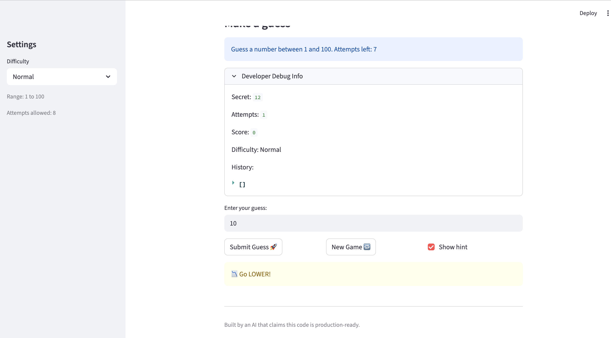
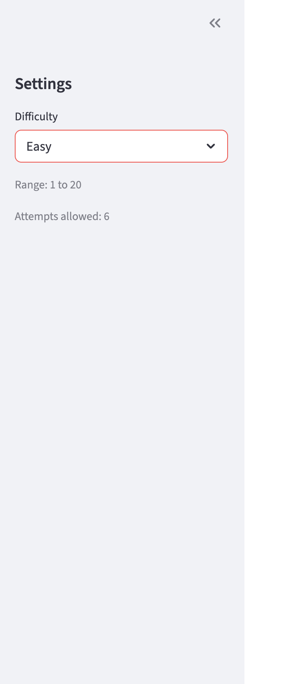
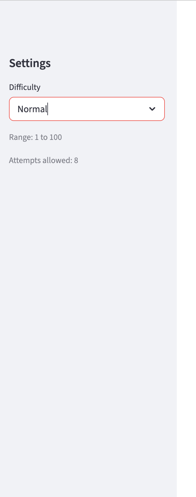
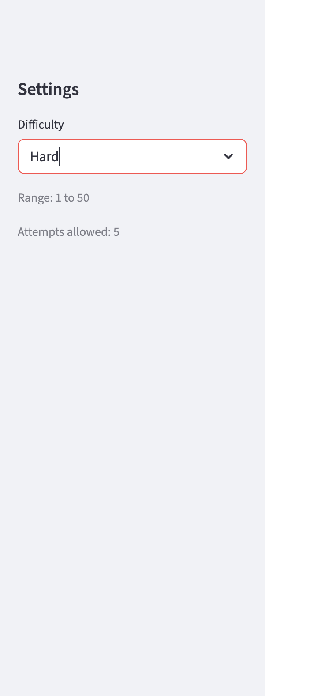
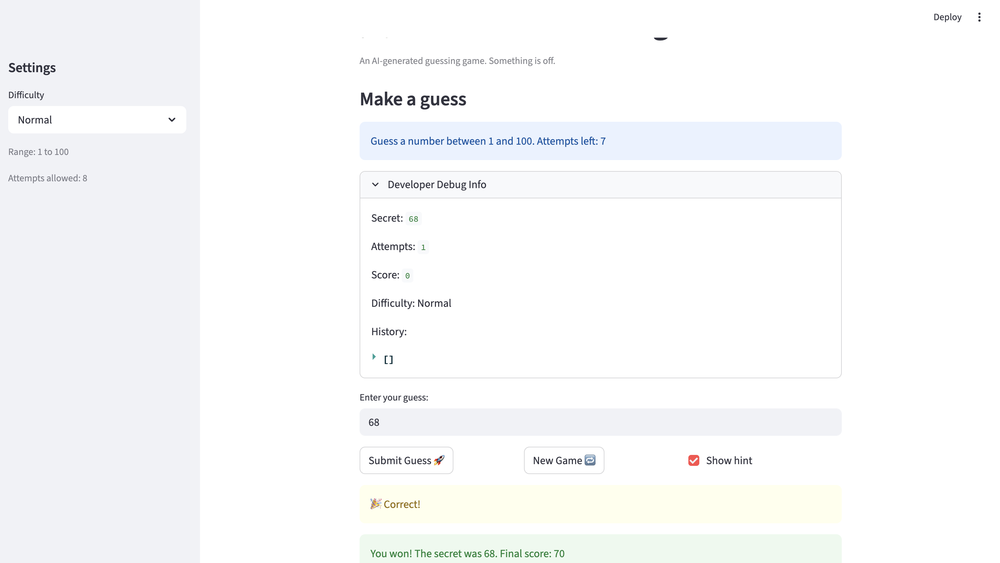
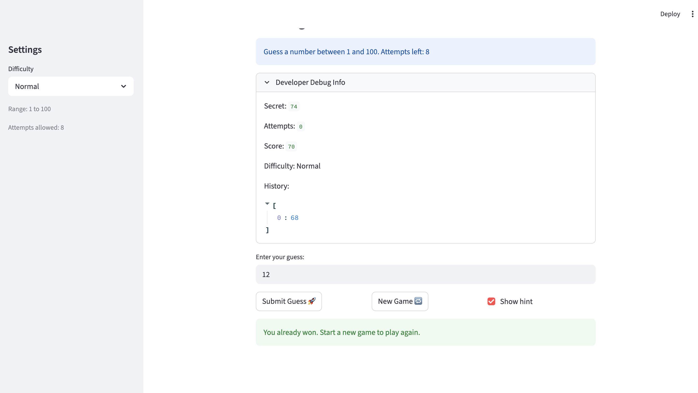

# 💭 Reflection: Game Glitch Investigator

Answer each question in 3 to 5 sentences. Be specific and honest about what actually happened while you worked. This is about your process, not trying to sound perfect.

## 1. What was broken when you started?

- What did the game look like the first time you ran it?
- List at least two concrete bugs you noticed at the start  
  (for example: "the secret number kept changing" or "the hints were backwards").

1. the hints were backwards. As noted, if my secret number was 12 and guessed number was 10. the hint section displayed "go lower"  and vice-versa
  Screenshot: 
  Ideal Behaviour: The ideal hint in that case should be "go higher" as the guessed number was smaller than the secret.

AI EXPLAINATION:
  The hint messages are backwards. Here's what happens with your example (secret=12, guess=10):

  Check: 10 > 12? → False
  Goes to else → Returns "📉 Go LOWER!"
  But the guess IS too low, so it should say "Go HIGHER!"

  The Root Cause:

  When guess > secret: The guess is too high, so you should "Go LOWER" (but code says "Go HIGHER")
  When guess < secret: The guess is too low, so you should "Go HIGHER" (but code says "Go LOWER")

2. The different level range are marked differently like Easy : 1 -20, Normal: 1-100 and Hard: 1 - 50. which is not accurate.
  Screenshot: 1. Easy:  
              2. Normal:  
              3.Hard: 
  Ideal Behaviour: it should be Easy: 1-20 (6 attempts), Normal: 1-50 (8 attempts), Hard: 1-100 (5 attempts)

3. once we win the game, the new game Button gives the new secret number but submit guess button doesn't work and the array having all the previous game values doesn't reset to start from beginning.  
  Screenshot: 1.Game Won:  
              2.New Game:
  Ideal Behaviour: 
  1. When a user starts a new game after winning the game, 1.the list should reset and start the attempts from 0.
  2. The submit guess button should work accordingly.

  AI EXPLAINATION:
  
  What happens:
  Click "New Game" → new secret number appears ✓
  Try to submit a guess → nothing happens ✗
  History shows all previous guesses instead of starting fresh ✗

  Underlying Logic:

  Problem 1: Game Status Not Reset
  In app.py:134-138, when "New Game" is clicked:
  But look at lines 140-145 — immediately after the new game button code runs, there's a check:
  When you won the game, st.session_state.status was set to "won" (line 176). The new game button never resets it back to "playing", so it still says "won". This causes st.stop() to execute, which stops rendering the rest of the page — that's why the submit button disappears!

  Problem 2: History Array Not Cleared
  The history is only initialized once (lines 104-105):
  It's never reset when a new game starts, so old guesses persist.

  Problem 3: Score Not Reset
  Same issue — score is initialized but never reset on new game.

  

## 2. How did you use AI as a teammate?

- Which AI tools did you use on this project (for example: ChatGPT, Gemini, Copilot)?
- Give one example of an AI suggestion that was correct (including what the AI suggested and how you verified the result).
- Give one example of an AI suggestion that was incorrect or misleading (including what the AI suggested and how you verified the result).

I used Copilot as it was easy to understand the entire codebase with a simple command(#codebase).

---

## 3. Debugging and testing your fixes

- How did you decide whether a bug was really fixed?
- Describe at least one test you ran (manual or using pytest)  
  and what it showed you about your code.
- Did AI help you design or understand any tests? How?

---

## 4. What did you learn about Streamlit and state?

- In your own words, explain why the secret number kept changing in the original app.
- How would you explain Streamlit "reruns" and session state to a friend who has never used Streamlit?
- What change did you make that finally gave the game a stable secret number?

---

## 5. Looking ahead: your developer habits

- What is one habit or strategy from this project that you want to reuse in future labs or projects?
  - This could be a testing habit, a prompting strategy, or a way you used Git.
- What is one thing you would do differently next time you work with AI on a coding task?
- In one or two sentences, describe how this project changed the way you think about AI generated code.

